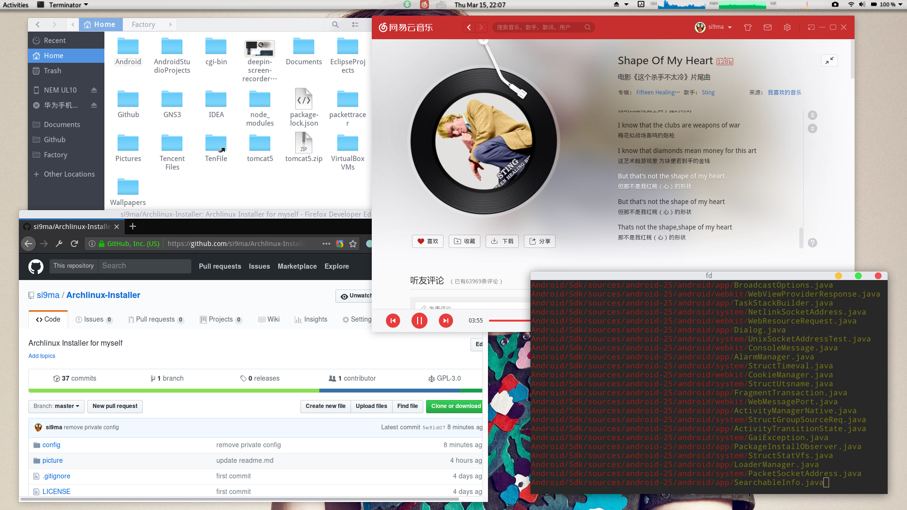

<h1 align="center">
   
  
   

Arch Linux Installer

</h1>

<h3 align="center">Install Arch Linux more quickly!</h3>

  <a href="#about">About</a> •
  <a href="#feature">Feature</a> •
  <a href="#i-want-say">I Want Say</a> •
  <a href="#how-to-use">How To Use</a> •
  <a href="#license">License</a>

## About

使用Linux也已经两年了，开始使用的是Ubuntu，后来各种折腾，换到了Archlinux，使用至今。在使用Archlinux过程中，各种折腾各种配置，各种快捷键，终于把Archlinux折腾成了自己觉得很好看，很好用的样子。但是问题就是，如果哪天我想重装我的Arch，我还得从头一个命令一个命令敲一遍。还得重新改各种配置，重新装各种常用的软件。虽然说从头敲一遍命令可以学到很多东西，但那是对于第一次装的时候。如果以后每次重装都重新敲一遍，岂不是很蠢，很浪费时间。所以呢，我就使用bash配合dialog工具，写了这个伪界面版本的Archlinux安装器。

## Feature

- 伪界面，相对纯纯的命令行，是不是友好那么点
- 支持KDE、Xfce、Gnome桌面系统的安装
- 支持Gnome桌面系统的简单配置
- 支持Gnome桌面系统的中文输入法(搜狗输入法)的安装
- 支持一些软件的配置的备份和恢复(可以添加自己的备份/恢复脚本)
- 支持Bios和UEFI两种启动方式
- 自动检测Windows启动项

## I Want Say

Arch Linux主张 “以用户为中心” ，让用户自己去动手控制自己的系统，让用户自己动手去解决问题。它的安装过程就体现了这一点。我写这个安装器并不是想违背这个观点。我也认为作为开发人员，应该自己动手去解决遇到的问题，解决问题能帮助我们学到更多的东西。我写这个安装器是为了能够更快速地恢复自己的系统环境。也是为了能够帮助刚开始使用Arch的童鞋能够一点点帮助。感兴趣的童鞋可以修改这个安装器，加入自己的软件备份/恢复脚本。

## How To Use

- [How To Use](how-to-use.md)
- [我的博客](https://coolcodes.me/2018/03/15/archlinux-installer/)

## Report Bug

欢迎提Bug !

## License

GNU General Public License v3.0

---

> [Blog: coolcodes.me](https://coolcodes.me)